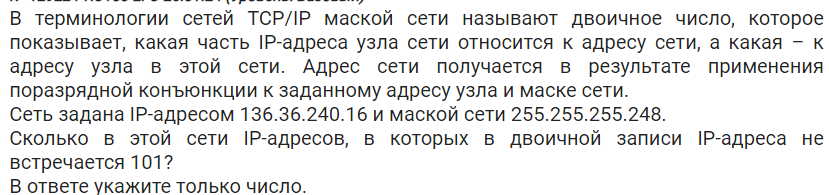
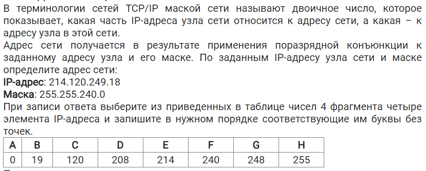
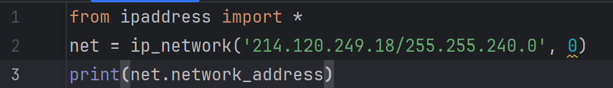
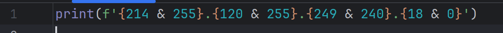
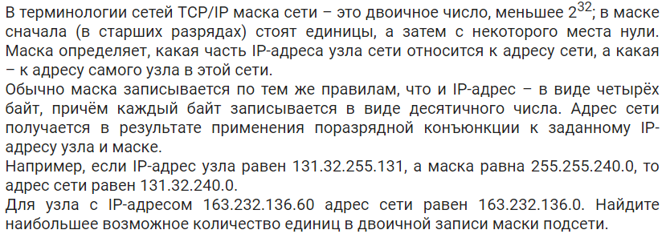
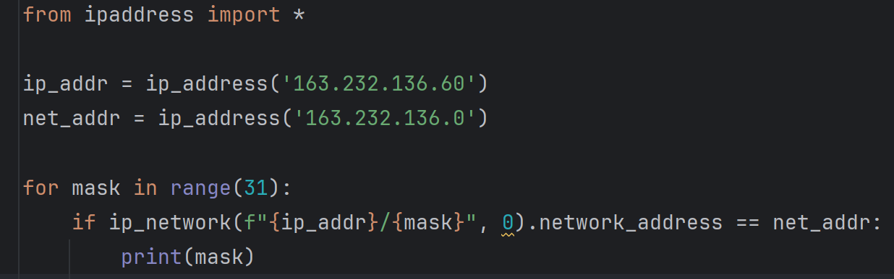
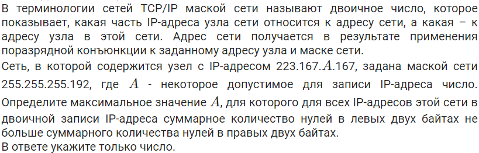
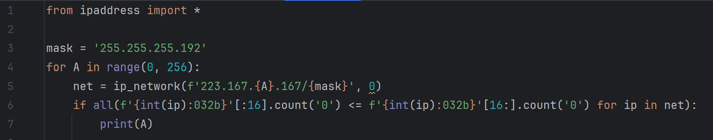
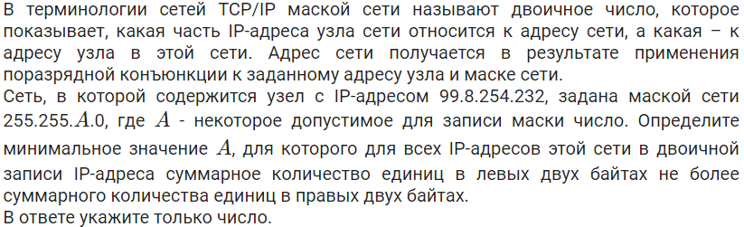
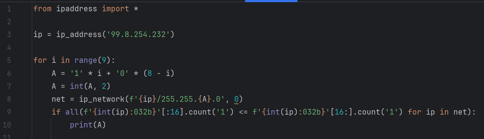

# Задание 13

## Тип №1: найти адреса узлов в сети и ... (посчитать адреса с каким то условием, определить максимальное значение и тд)
### Задача

### Решение

### Ответ
4
### Комментарий
`from ipaddress import *`: 
из библиотеки ipaddress импортируем всё, что там есть (по факту, могли бы написать `from ipaddress import ip_network`, так как нам нужна только функция ip_network)  

`net = ip_network('136.36.240.16/255.255.255.248', 0)`: ip_network - это функция, которая вернёт нам объект, в котором хранятся узлы сети  
Первый аргумент функции должен выглядеть так: 'адрес узла или адрес сети/маска'
Значит, мы запишем его так: '136.36.240.16/255.255.255.248'  
Второй аргумент всегда должен быть 0, можно с этим не заморачиваться

`c = 0`: вводим счётчик

`for ip in net:`: так как в нет хранятся узлы сети, то можно перебрать его с помощью цикла for

`if f'{int(ip):032b}'.count('101') == 0: `: разберемся по порядку  
`f'{int(ip):032b}'` - ip можно перевести в числовой вид и привести его к виду двоичного числа длины 32 с помощью специального форматирования, все это делаем в f-строке  
Это нам нужно потому, что ip адреса, адреса сетей и маски, с которыми мы работаем - это двоичные числа длины 32.  
`if f'{int(ip):032b}'.count('101') == 0: `: если в адресе нет 101  
`c += 1`: то прибавляем счётчик

`print(c)`: выводим счётчик

## Тип №2 Найти адрес сети 
### Задача

### Решение

### Ответ
Программа вывела 214.120.240.0  
Ответ ECFA
### Комментарий
`from ipaddress import *`: импортим всё из библиотеки  
`net = ip_network('214.120.249.18/255.255.240.0', 0)`:  
Из задачи выше: Первый аргумент функции должен выглядеть так: 'адрес узла или адрес сети/маска', поэтому тут `'214.120.249.18/255.255.240.0'` написали по сути 'адрес узла/маска'  
`print(net.network_address)`: у net есть свойство network_address, которое буквально означает адрес сети, который нам как раз и нужен. выводим его и пишем ответ

### Другой вариант решения

`print(f'{214 & 255}.{120 & 255}.{249 & 240}.{18 & 0}')` - это весь код, который нужен для решения.  
Из теории мы с вами знаем, что если применить к соответствующим байтам в адресе узла и маске (т.е. 1 с 1, 2 со 2 и т.д.) поразрядную конъюнкцию (в питоне это операция производится через амперсанд &), то мы получим байты адреса сети  
Вывод получим такой же - 214.120.240.0

## Тип №3 (посчитать возможные маски, найти максимум чего-то там в маске и тд)
### Задача

### Решение

### Ответ
26
### Комментарий
`from ipaddress import *`: импортим всё из библиотеки  
`ip_addr = '163.232.136.60'`
`net_addr = '163.232.136.0'`: задаем переменные с адресом узла и адресом сети  
`for mask in range(31):`: почему мы перебираем маску среди чисел 0...30?  
Раньше мы с вами использовали такой формат: `ip_network('136.36.240.16/255.255.255.248', 0)`, то есть маску писали через 4 числа - 255.255.255.248.  
Давайте вспомним, что маска в двочном виде - это сначала идущие подряд единицы, а потом идущие подряд нули, по типу: 1111111111111111110000000000000  
так вот, в `for mask in range(31):` mask - это число единиц в маске (обычно в маске не используется 31 и 32 единицы, поэтому перебираем среди 0...30)  
теперь, когда мы используем `ip_network(f"{ip_addr}/{mask}", 0)`, ip_addr - это так же адрес из 4 чисел, а mask - это кол-во единиц в маске (то есть какая то реально существующая маска).  
`if ip_network(f"{ip_addr}/{mask}", 0) == ip_network(f"{net_addr}/{mask}", 0):`:  
тут мы проверяем, что сеть, которую мы получили из адреса узла и маски равна сети, которую мы получили из адреса сети и маски.  
Если они равны, то такая маска действительно может быть для данного адреса сети и адреса узла.
`print(mask)`: - тут выводим число единиц в маске, и по условию задачи ищем наибольшее возможное число  
## Тип №4 (параметр А в ip-адресе)
### Задача

### Решение

### Ответ
248
### Комментарий
`from ipaddress import *`: импортим всё из библиотеки  
`mask = '255.255.255.192'`: объявляем маску  
`for A in range(0, 256):`: перебираем параметр А - в адресе может быть число от 0 до 255  
`net = ip_network(f'223.167.{A}.167/{mask}', 0)`: подставляем параметр А в адрес узла, получаем сеть  
`if all(f'{int(ip):032b}'[:16].count('0') <= f'{int(ip):032b}'[16:].count('0') for ip in net):`: тут посмотрим поэтапно:  
1. `f'{int(ip):032b}'` - ip в двоичном виде длины 32  
1. `f'{int(ip):032b}'[:16].count('0') `- берем срез [:16] - это два левых байта, и считаем количество нулей  
1. `f'{int(ip):032b}'[16:].count('0')` - берем срез [16:] - это два правых байта, и считаем количество нулей  
1. `f'{int(ip):032b}'[:16].count('0') <= f'{int(ip):032b}'[16:].count('0')` - если слева нулей не больше, чем справа (то есть меньше равно), то это выражение даст True, если нет, то False  
1. `f'{int(ip):032b}'[:16].count('0') <= f'{int(ip):032b}'[16:].count('0') for ip in net` - это как бы список из True или False для каждого ip в net
1. `all(f'{int(ip):032b}'[:16].count('0') <= f'{int(ip):032b}'[16:].count('0') for ip in net)` - если для всех ip получим True (то есть все элементы списка будут равны True), то функция all вернет True. если хотя бы для одного ip будет False, то all вернет False.  
`print(A)`: выводим А, и среди выведенных ищем максимальный

## Тип №5 (параметр А в маске)
### Задача

### Решение

### Ответ
248
### Комментарий
`from ipaddress import *`: импортим всё из библиотеки  
`ip = ip_address('99.8.254.232')`: объявляем ip адрес узла, ip_address - функция, которая вернет адрес в специальном формате (это нужно для того, чтобы int(ip) перевела айпи в числовой вид, если бы мы написали int('99.8.254.232'), то была бы ошибка)  
`for i in range(9):`: i - это количество единиц в параметре A  
Вспоминаем, что в такой маске - 255.255.{A}.0 - A может быть одним из следующих (00000000, 10000000, 11000000,..., 11111111 - от нуля единиц до 8 единиц)  
`A = '1' * i + '0' * (8 - i)`: A - это i единиц плюс (8 - i) нулей - тут всё понятно :grin:  
`A = int(A, 2)`: A из двоичной системы переводим в десятичную  
`net = ip_network(f'{ip}/255.255.{A}.0', 0)`  
`if all(f'{int(ip):032b}'[:16].count('1') <= f'{int(ip):032b}'[16:].count('1') for ip in net):`  
`    print(A)`: - тут все то же самое, что в задаче выше

