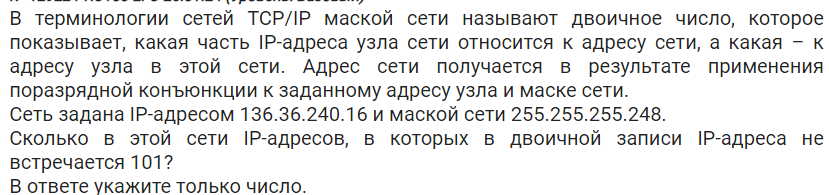
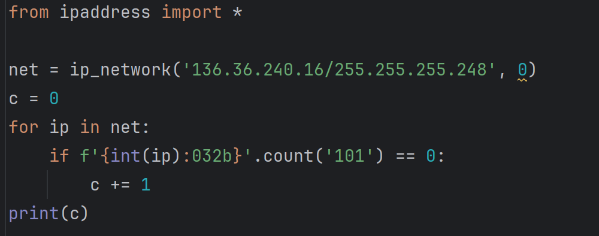

# Задание 13

## №1
### Задача

### Решение

### Комментарий
`from ipaddress import *`: 
из библиотеки ipaddress импортируем всё, что там есть (по факту, могли бы написать `from ipaddress import ip_network`, так как нам нужна только функция ip_network)  

`net = ip_network('136.36.240.16/255.255.255.248', 0)`: ip_network - это функция, которая вернёт нам объект, в котором хранятся узлы сети  
Первый аргумент функции должен выглядеть так: 'адрес узла или адрес сети/маска'
Значит, мы запишем его так: '136.36.240.16/255.255.255.248'  
Второй аргумент всегда должен быть 0, можно с этим не заморачиваться

`c = 0`: вводим счётчик

`for ip in net:`: так как в нет хранятся узлы сети, то можно перебрать его с помощью цикла for

`if f'{int(ip):032b}'.count('101') == 0: `: разберемся по порядку  
`f'{int(ip):032b}'` - ip можно перевести в числовой вид и привести его к виду двоичного числа длины 32 с помощью специального форматирования, все это делаем в f-строк  
Это нам нужно потому, что ip адреса, адреса сетей и маски, с которыми мы работаем - это двоичные числа длины 32.

`c += 1`: прибавляем счётчик

`print(c)`: выводим счётчик
