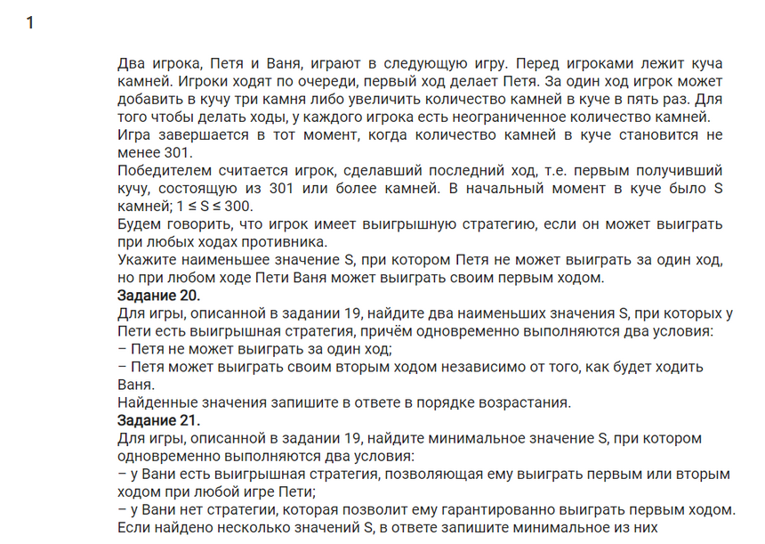
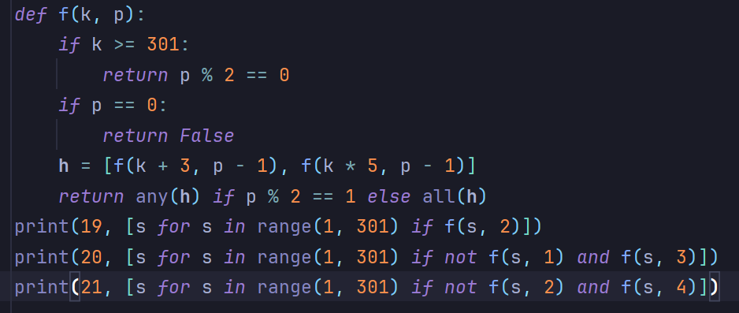
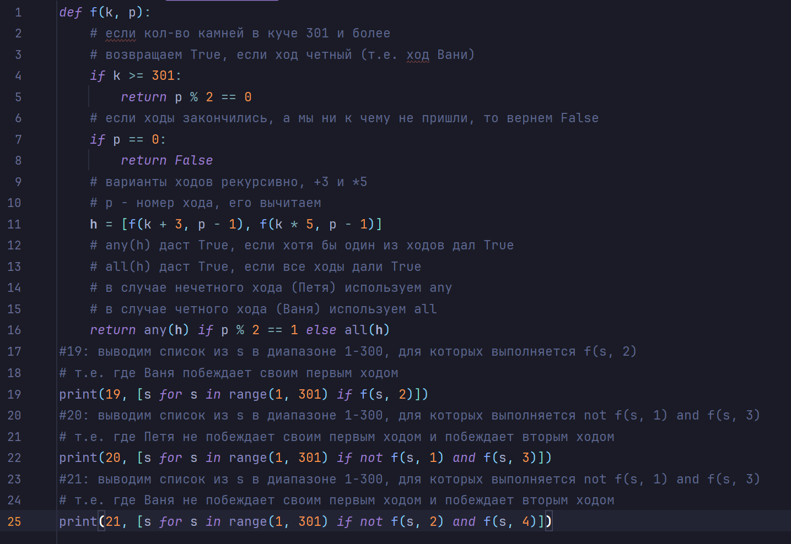
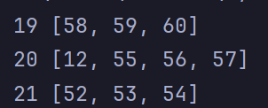
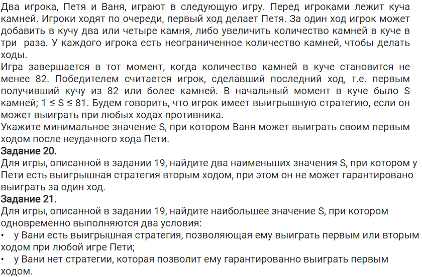

# Задания 19-21

## 1 куча
### Тип №1 - в 19 задаче говорится, что Ваня выиграет при ЛЮБОМ ходе Пети
#### Задача

#### Решение без комментов

#### Решение c комментами

#### Вывод

В ответе будем писать всё в соостветствии с задачей.  
Мы получили список из S, которые в каждой задаче удовлетворяют условию.  
Для 19 нам нужно наименьшее значение, значит в ответе пишем 58  
Для 20 - два наименьших в порядке возрастания - 12 55
Для 21 - минимальное значение - 52

### Тип №2 - в 19 задаче просят указать минимальное S, когда ВОЗМОЖЕН выигрыш Вани
#### Задача

#### Решение

Решение в таком случае проходит в два этапа  
##### 1 этап
Пишем такой же шаблон, как и в предыдущей задаче

Пока что тут не доделано ;)
