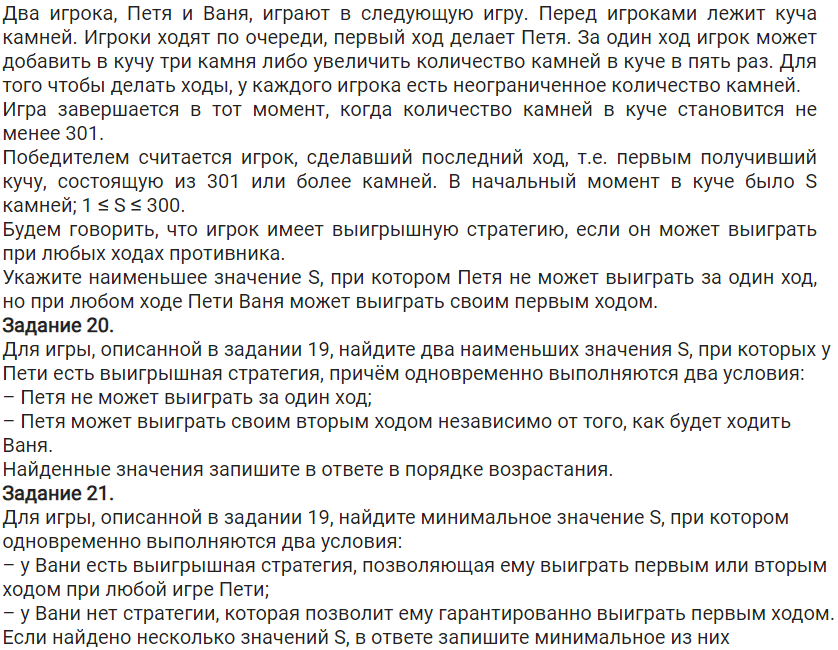

<<<<<<< HEAD
# Задания 19-21

## 1 куча
### Тип №1 - в 19 задаче говорится, что Ваня выиграет при ЛЮБОМ ходе Пети
#### Задача

#### Решение без комментов

#### Решение c комментами

#### Вывод

В ответе будем писать всё в соостветствии с задачей.  
Мы получили список из S, которые в каждой задаче удовлетворяют условию.  
Для 19 нам нужно наименьшее значение, значит в ответе пишем 58  
Для 20 - два наименьших в порядке возрастания - 12 55
Для 21 - минимальное значение - 52

### Тип №2 - в 19 задаче просят указать минимальное S, когда ВОЗМОЖЕН выигрыш Вани
#### Задача

#### Решение

Решение в таком случае проходит в два этапа  
##### 1 этап
Пишем такой же шаблон, как и в предыдущей задаче

Пока что тут не доделано ;)
=======
# Задание 19-21

Задачи 19-21 решаются вместе, тк в 20 и 21 используются условия из 19.  
Подразумеваю, что вы уже знаете, в чем суть этих задач, поэтому сразу введем для себя параметр p, которые будет обозначать номера ходов Вани и Пети (по факту p - это кол-во ходов до завершения игры).  

## Тип №1: 1 Куча камней, В 19 задаче Ваня выиграет ПРИ ЛЮБОМ ходе Пети
### Задача

### Решение

### Комментарий
Функция f принимает два аргумента: кол-во камней в куче k и номер хода p  
`if k >= 301:`  
`return p % 2 == 0`  
Если кол-во камней превысило победное, то вернем True при четном ходе  
`if p == 0:`  
`return False`  
Если ходы закончились, то вернем False, тк ни к чему не пришли  
`h = [f(k + 3, p - 1), f(k * 5, p - 1)]`  
Задаем ходы рекурсивно, +3 и *5  
`return any(h) if p % 2 == 1 else all(h)`  
Если p - нечетное, то вернем True если хотя бы 1 ход дал True  
Если p - четное, то вернем True если все ходы дали True  
`print(19, [s for s in range(1, 301) if f(s, 2)])`  
В список запишем все s (начальное кол-во в куче), при которых будет выигрыш Вани 1 ходом (смотрим в таблицу)  
`print(20, [s for s in range(1, 301) if not f(s, 1) and f(s, 3)])`  
В список запишем все s (начальное кол-во в куче), при которых не будет выигрыша Пети 1 ходом и будет выигрыш Пети 2 ходом (смотрим в таблицу)  
`print(21, [s for s in range(1, 301) if not f(s, 2) and f(s, 4)])`  
В список запишем все s (начальное кол-во в куче), при которых не будет выигрыша Вани 1 ходом и будет выигрыш Вани 2 ходом (смотрим в таблицу)  
### Ответ - 58; 12 55; 52
## Тип №2: 1 Куча камней, В 19 задаче НЕ ГОВОРИТСЯ, что Ваня должен выиграть при ЛЮБОМ ходе Пети
### Задача

### Решение
Решаем в 2 этапа: сначала в функции меняем all на any и решаем 19 задачу  
Зачем это нужно? В задаче не говорится, что при всех ходах Пети Ваня выиграет, поэтому вместо all (все ходы True) нам нужна any (хотя бы один ход True)  
  
Далее меняем обратно на all, и решаем 20 и 21  

### Ответ
19 - 10  
20 - 9 22  
21 - 21  
>>>>>>> 35e54d8976f28bdc9fe8a31f01b7d828eac30800
