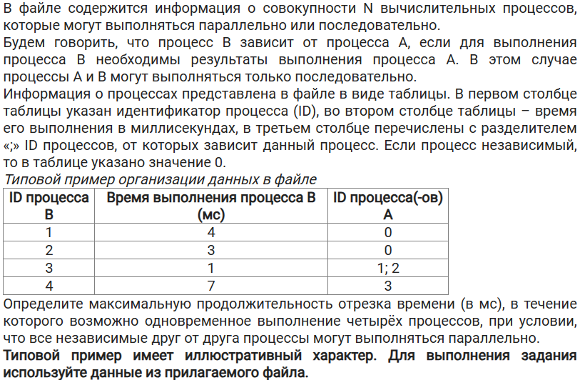

# Задание 22

## Тип №1: найти максимальную продолжительность отрезка времени, в течение которого возможно одновременное выполнение N процессов (независимые процессы выполняются параллельно)
### Задача
[Ссылка на файлы](https://disk.yandex.ru/d/JJVj5xcLUmAlIg)
Файл 22_1

### Решение