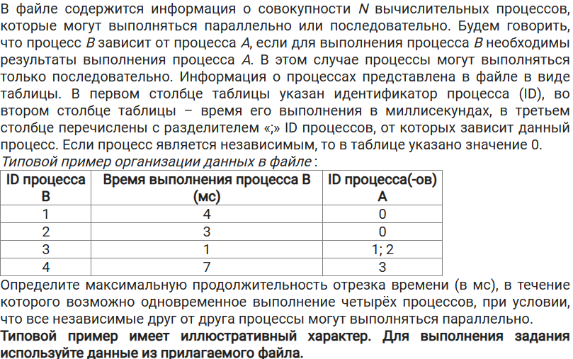
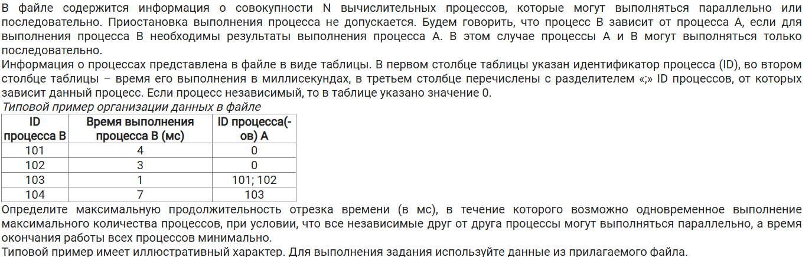
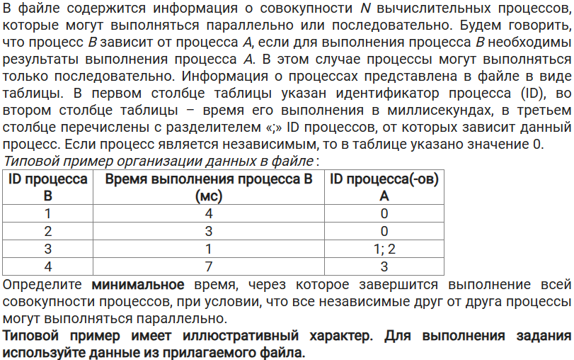
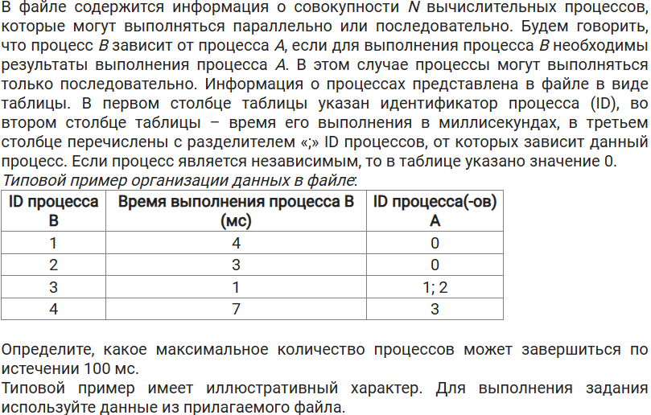
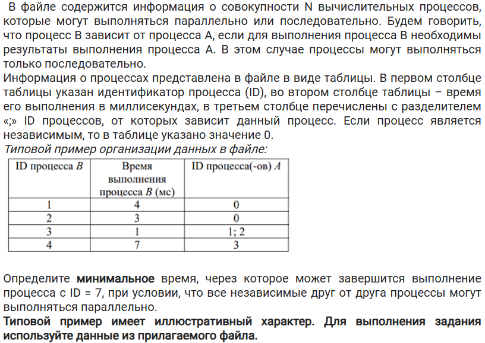

# Задание 22

## Тип №1: найти максимальную продолжительность отрезка времени, в течение которого возможно одновременное выполнение N процессов (независимые процессы выполняются параллельно)
### Задача 1
[Ссылка на файлы](https://disk.yandex.ru/d/JJVj5xcLUmAlIg)
Файл 22_1

### Решение
[Видеоразбор](./source/22_1.mp4)  
*Текстовый добавлю когда-нибудь, пока что лень*
### Задача 2
[Ссылка на файлы](https://disk.yandex.ru/d/JJVj5xcLUmAlIg)
Файл 22_2

### Решение
[Видеоразбор](./source/22_2.mp4)  
*Текстовый добавлю когда-нибудь, пока что лень*
## Тип №2: найти максимальную продолжительность отрезка времени, в течение которого возможно одновременное выполнение максимального кол-ва процессов (независимые процессы выполняются параллельно), при этом время окончания работы всех процессов МИНИМАЛЬНО
### Задача
[Ссылка на файлы](https://disk.yandex.ru/d/JJVj5xcLUmAlIg)
Файл 22_13

### Решение
[Видеоразбор](./source/22_13.mp4) 
## Тип №3: Минимальное время окончания всех процессов
### Задача
[Ссылка на файлы](https://disk.yandex.ru/d/JJVj5xcLUmAlIg)
Файл 22_3

### Решение
[Видеоразбор](./source/22_3.mp4) 
## Тип №4: Сколько процессов завершится по истечении такого-то времени
### Задача
[Ссылка на файлы](https://disk.yandex.ru/d/JJVj5xcLUmAlIg)
Файл 22_6

### Решение
[Видеоразбор](./source/22_6.mp4) 
## Тип №5: Минимальное время когда завершится процесс с iD = N
### Задача
[Ссылка на файлы](https://disk.yandex.ru/d/JJVj5xcLUmAlIg)
Файл 22_8

### Решение
[Видеоразбор](./source/22_8.mp4) 